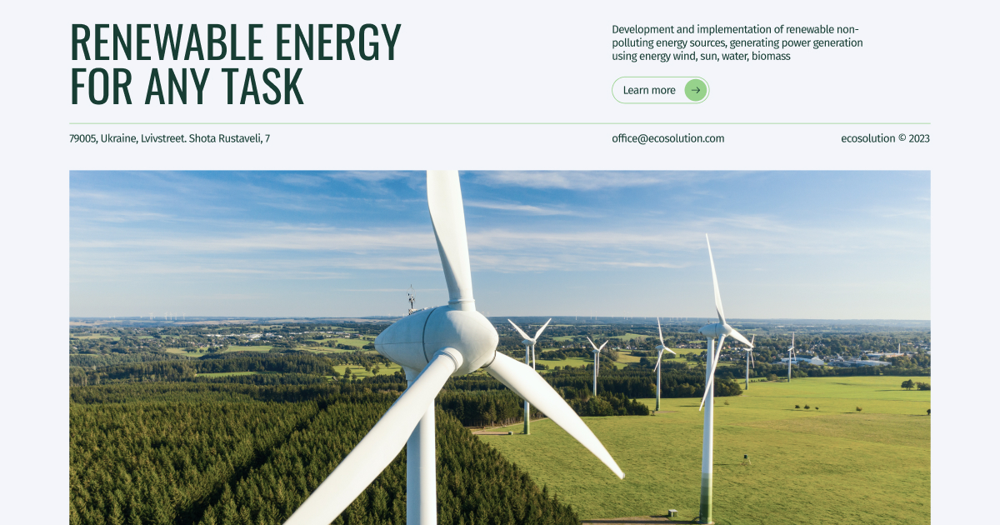
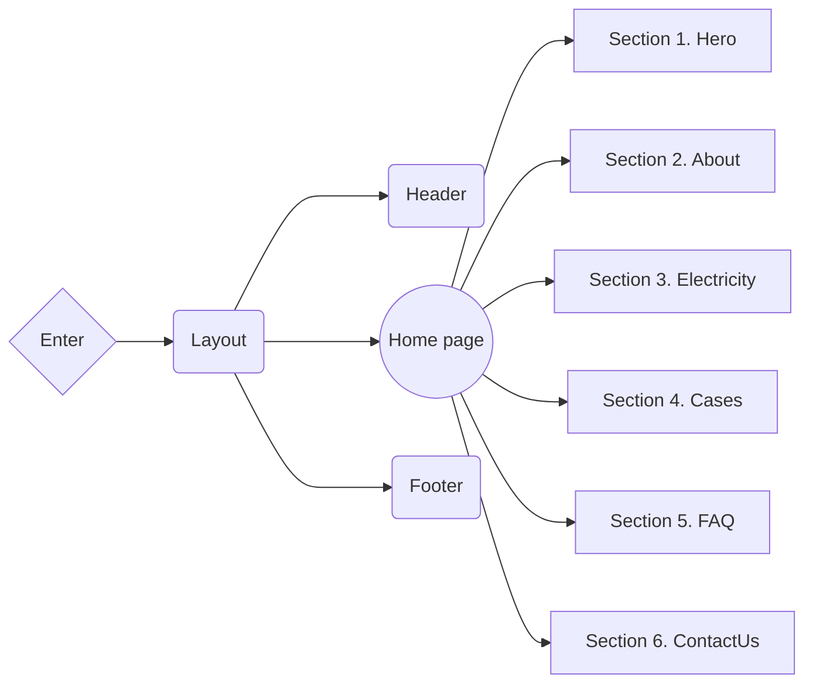

# Ecosolution

**[View live page](ecosolution-ten.vercel.app)**

---

## 🗂️ Project description 🗂️

### Goals

Implement the Ecosolution landing page according to the technical
specifications.

### Used Technologies:

- Next.js
- TypeScript
- Tailwind

### Acceptance Criteria

- The layout is fixed in pixels.
- Semantic and valid markup; accessibility (a11y) is a bonus.
- Responsive and cross-browser layout:
  - Mobile: 360px to 480px (fluid layout, should stretch);
  - Tablet: 768px;
  - Desktop: 1280px.
- Utilize the Mobile-First approach.
- Clean code with preserved formatting. Consider using ESLint/Prettier.
- Code is divided into separate components.

### Supported Languages

- English

### Project structure

## 📂 Deployment

To deploy this project, you need to perform the following steps:

1. **Clone the repository**: Use the `git clone` command to clone this
   repository to your computer.
2. **Install the dependencies**: Open a terminal in the root of the project and
   run `npm install` or `yarn install` to install all required dependencies.
3. **Setting environment variables**: Create a `.env` file in the root folder
   and add the necessary environment variables that you need for the project
   according to the `.env.example` file.
4. **Run the application**: Run the `npm run dev` or `yarn dev` command to run
   the project on the local server.
5. **Deploy**: To deploy this project to a production server, use hosting
   platforms such as Vercel, Netlify, or others.
